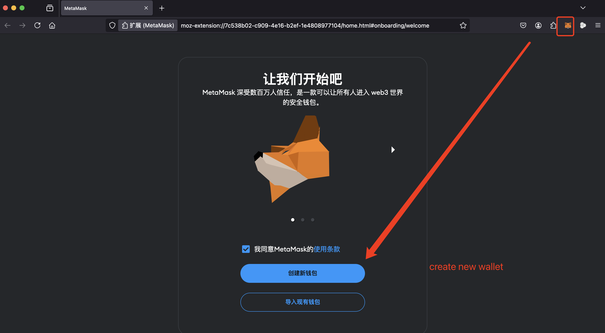
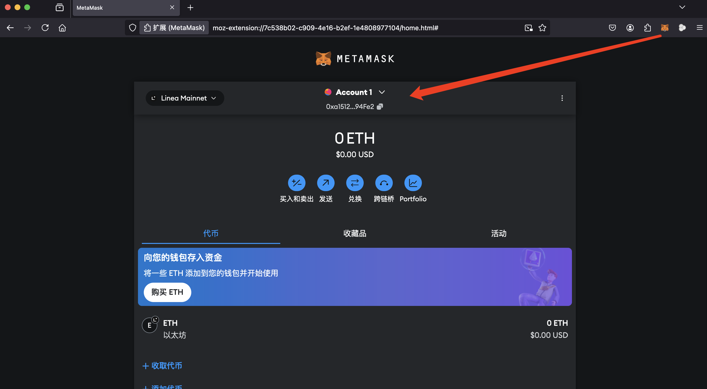
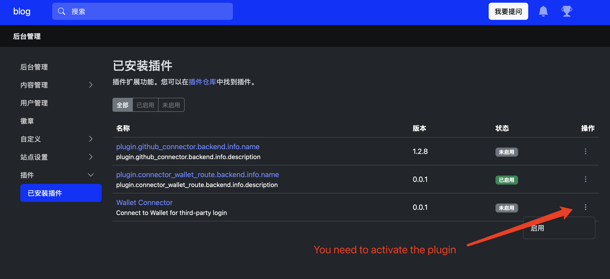
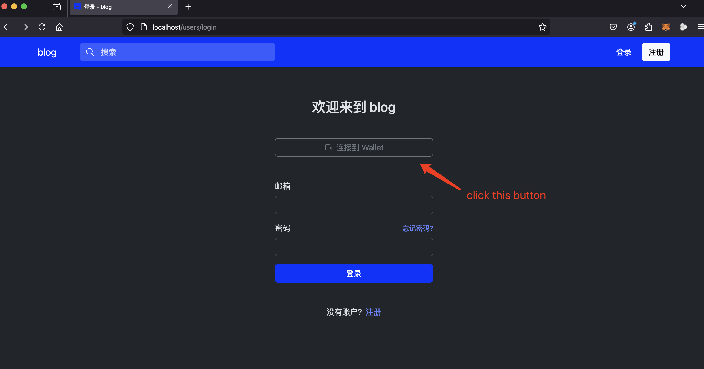
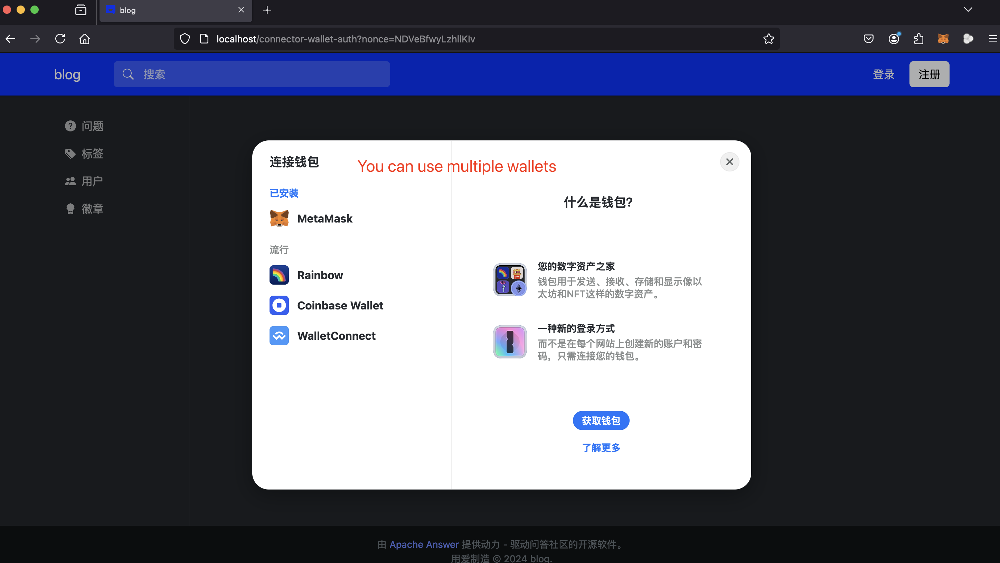
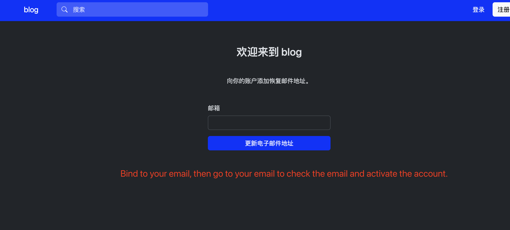

# Wallet connector
> Wallet connector is a OAuth plug-in designed to support Wallet OAuth login.

## How to use

### Build
```bash
./answer build --with github.com/apache/incubator-answer-plugins/connector-wallet
```

### Use Case

- Step 1: Install the wallet plug-in on your chrome/firefox browser. ex:MetaMask,BitgetWallet.


- Step 2: Generate your web3 wallet.






- Step3: Build your answer with golang and register the plugin.



- Step4: Log in through your wallet and bind to your email.





