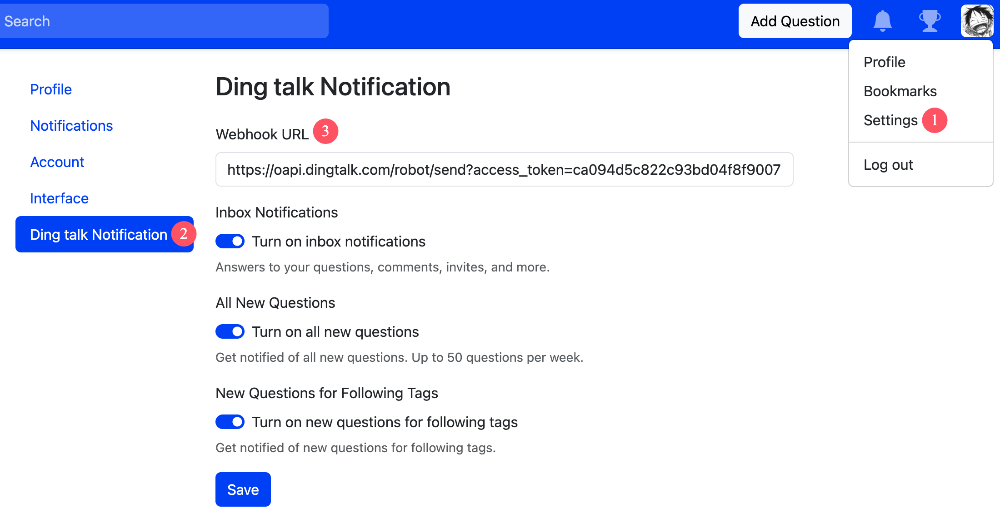

# Ding talk Notification

## Feature

- Send message to Ding talk

## Config

> Config Webhook URL and open the notification

- Webhook URL: such as `https://oapi.dingtalk.com/robot/send?access_token=xxxxxx`

## Preview

## Document

- https://open.dingtalk.com/document/robots/custom-robot-access
- https://open.dingtalk.com/document/orgapp/custom-bot-send-message-type