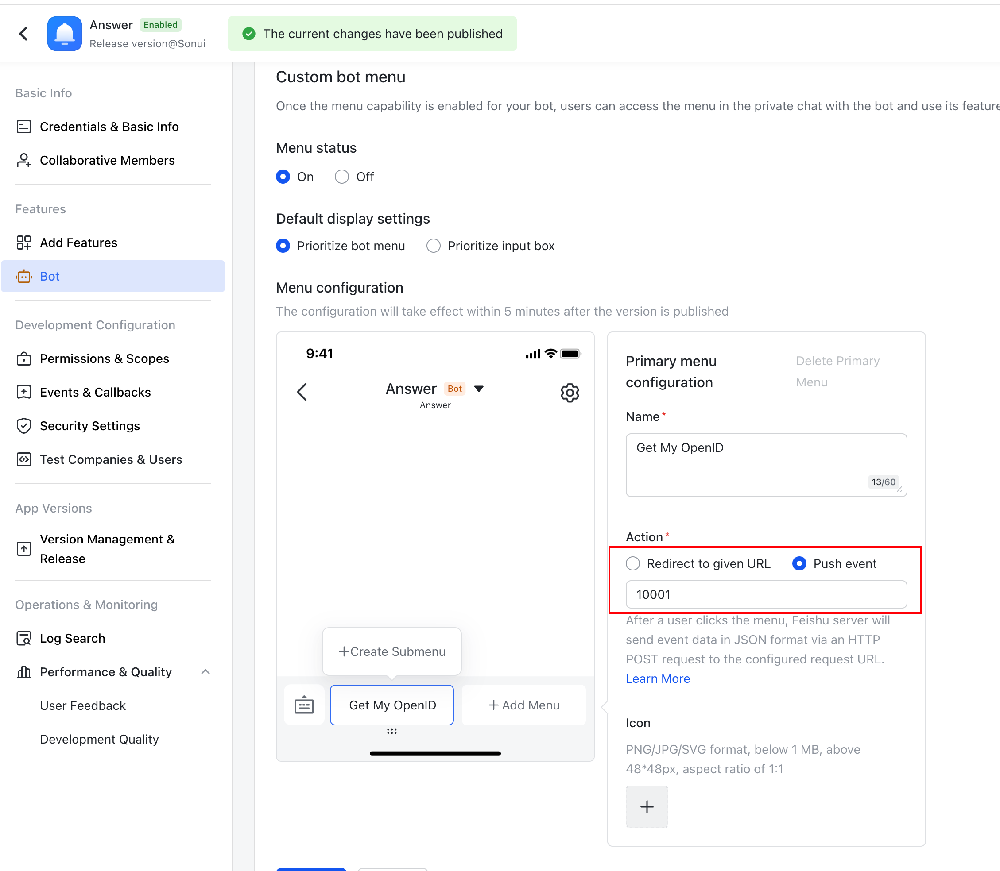
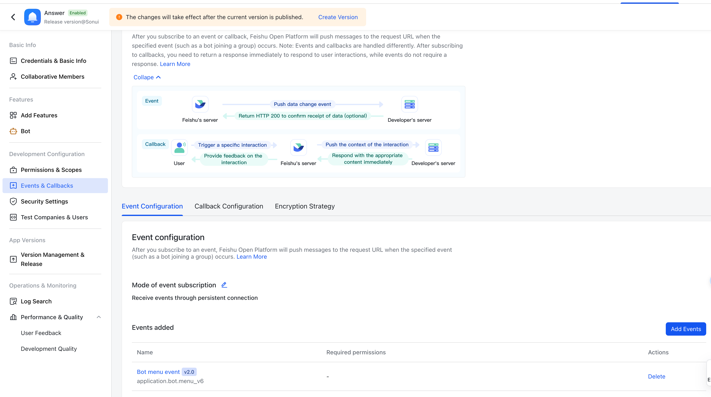

# NotificationLark Plugin

[English](./README.md) | [中文](./README_CN.md)

## How to use

To use the NotificationLark plugin with your application, install it using the following command:

```bash
./answer build --with github.com/apache/incubator-answer-plugins/notification-lark
```

## How to config

### For Administrators

#### Creating a Bot

1. Create a Bot in Lark or Feishu:
   * Visit [Lark](https://open.larksuite.com) or [Feishu](https://open.feishu.cn) to create a new bot.
   * Add `im:message:send_as_bot` Permission to the bot in the `Permission & Scopes` tab.
   * In the bot settings, enable the Custom Bot Menu and set the action type to Push Event.
   * Configure the menu event with `10001` as the event code.
    

2. Configure Events and Callbacks:
   * Navigate to the Events & Callbacks tab.
   * Set the `Mode of event subscription` to `Receive events through persistent connection`.
   * Add the `application.bot.menu_v6` event ID to your Event Configuration.
    

3. Release the Bot Version: Once the above settings are configured, proceed to release your bot version.

#### Website Configuration

Set the following parameters based on your requirements:

* Brand: Choose between Lark and Feishu as they are separate brands.
* App ID: Your bot's App ID, typically formatted as `cli_xxx`.
* App Secret: Your bot's secret key.
* Verification Token: (Optional) `Verification token` from the bot `Events & Callbacks` => `Encryption Strategy`.
* Encrypt Key: (Optional) `Encrypt key` from the bot `Events & Callbacks` => `Encryption Strategy`.

### For User

1. Interact with the Bot:
   * Click on the bot menu in the chat interface to trigger interactions.
   * Upon interaction, you will receive your open ID from the bot.
2. User Settings:
   * Enter your Open ID in the user settings.
   * Select which notifications you wish to receive under Notifications Choices.
