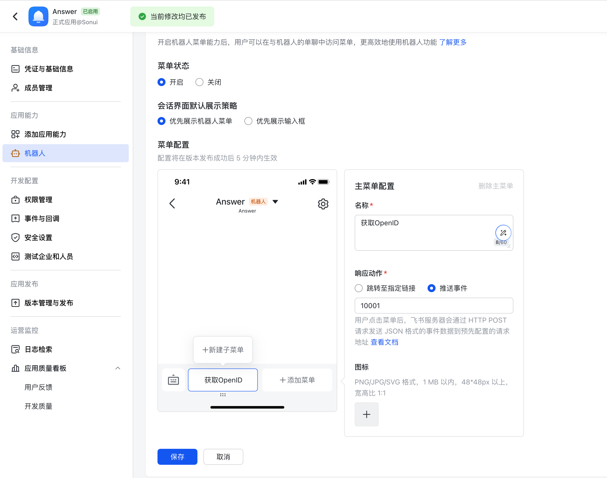
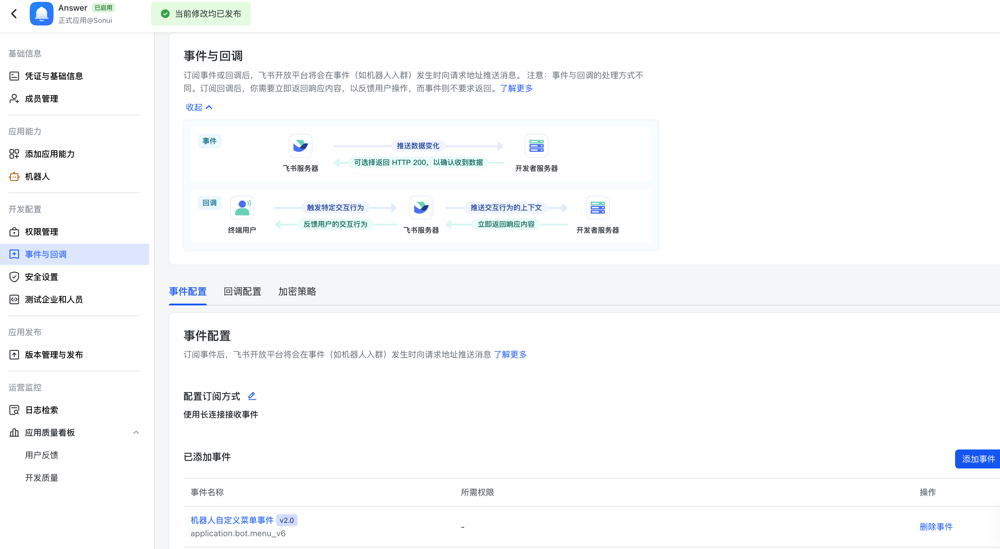

# NotificationLark Plugin

[English](./README.md) | [中文](./README_CN.md)

## 如何使用

要在应用程序中使用飞书通知插件，请使用以下命令进行安装：

```bash
./answer build --with github.com/apache/incubator-answer-plugins/notification-lark
```

## 如何配置

### 对于管理员

#### 创建机器人

1. 在 Lark 或飞书中创建机器人：
    * 访问 [Lark](https://open.larksuite.com) 或 [飞书](https://open.feishu.cn) 创建一个新的机器人。
    * 添加 `im:message:send_as_bot` 权限在机器人的 `权限管理` 选项卡。
    * 在机器人设置中，启用自定义机器人菜单，并将操作类型设置为 `推送事件`。
    * 使用`10001`作为配置菜单事件代码。
     
2. 配置事件和回调：
    * 导航到事件和回调选项卡。
    * 设置 `配置订阅方式` 为 `使用长连接接收事件`。
    * 将 `application.bot.menu_v6` 事件ID添加到您的事件配置中。
     

3. 发布机器人版本：配置完上述设置后，发布机器人版本。

#### 网站配置

根据您的需求设置以下参数：

* 品牌：选择 `Lark` 或 `飞书` 作为通知渠道。
* App ID：您的机器人AppID，通常格式为 `cli_xxx`。
* App Secret：您的机器人密钥。
* Verification Token：（可选）机器人 `事件与回调` => `加密策略` 中的 `Verification Token`。
* Encrypt Key：（可选）机器人 `事件与回调` => `加密策略` 中的 `Encrypt Key`。

### 对于用户

1. 与机器人互动：
    * 在聊天界面中点击机器人菜单以触发互动。
    * 互动后，您将从机器人收到您的OpenID。
2. 用户设置：
    * 在用户设置中输入您的`OpenID`。
    * 在通知选项下选择您希望接收的通知。
