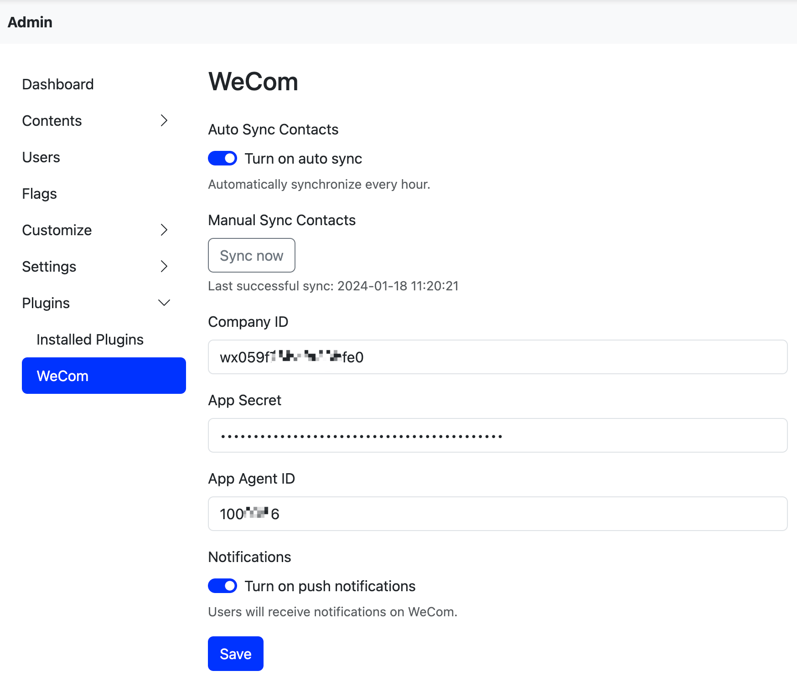
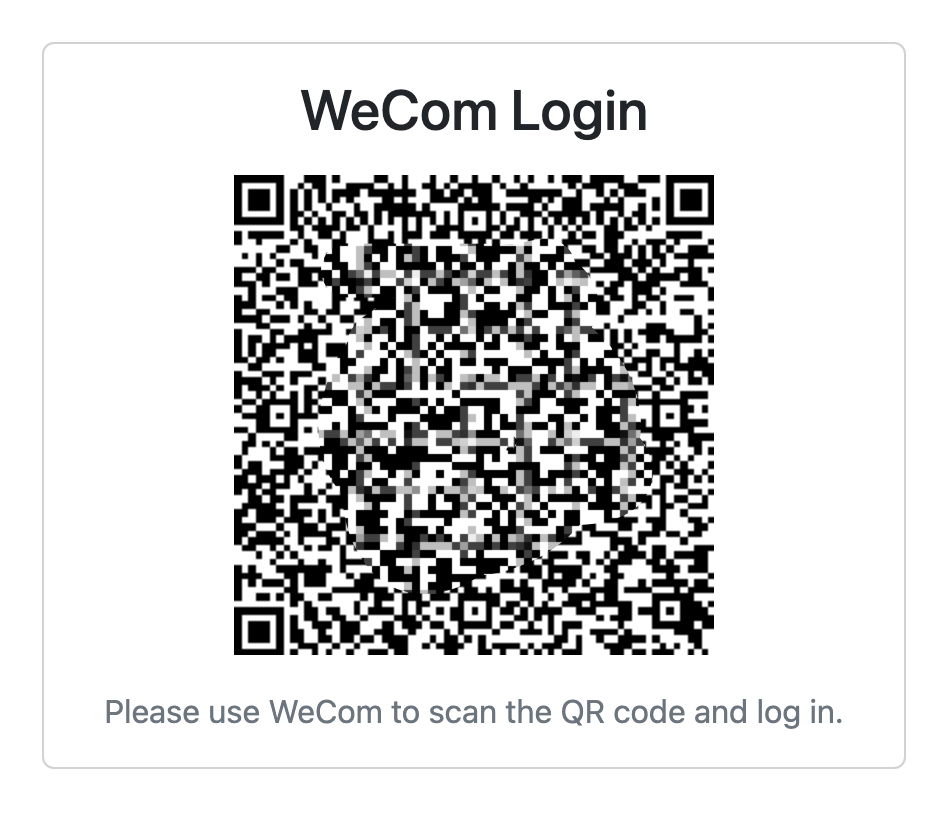
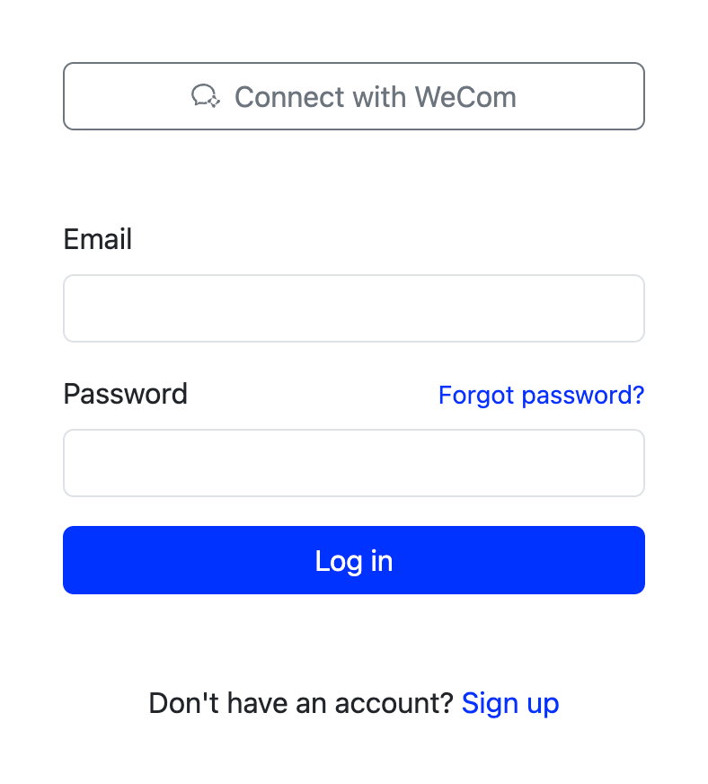

# WeCom User Center
## Feature
- User login via WeCom QRCode

## Config
> You need to create a WeCom App first, and then get the `Corp ID`, `Agent ID` and `App Secret` from the App. 

- `Company ID`: WeCom Corp ID
- `App Secret`: WeCom App Secret
- `App Agent ID`: WeCom App Agent ID

Note: WeCom restricts the ip address of the callback url, so you need to add the ip address of the server where the project is located to the callback url.

## Preview

## Document
- https://developer.work.weixin.qq.com/document/path/90664